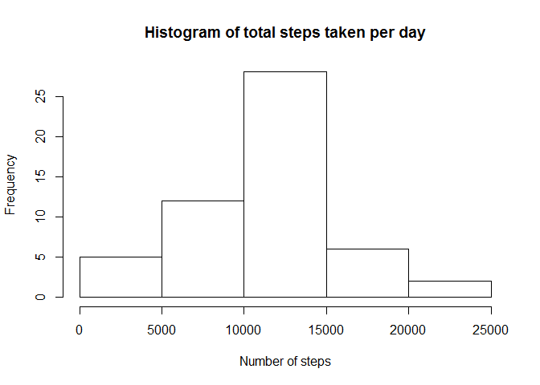
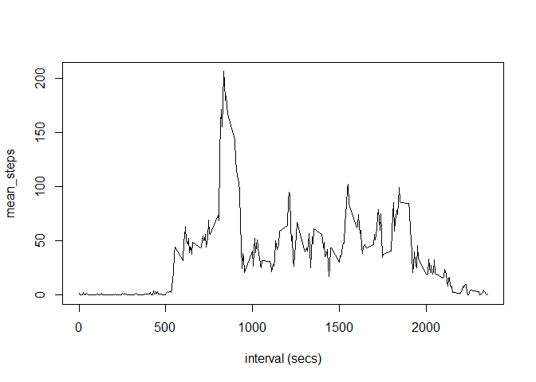
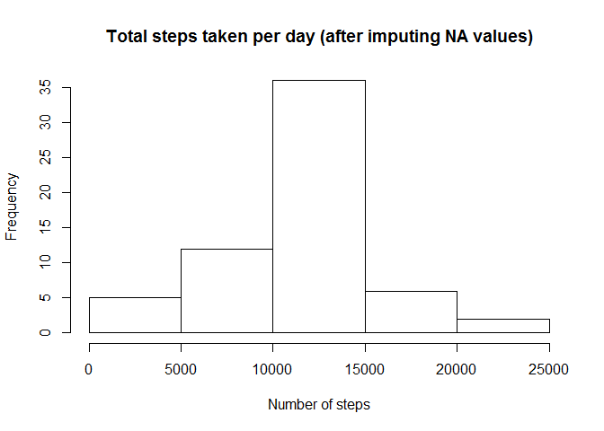
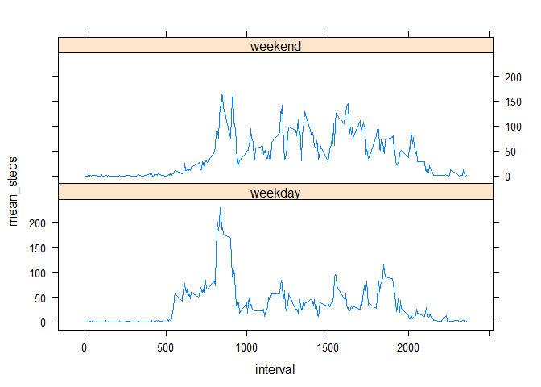

# Reproducible Research Peer Assessment 1
Don Cornell  
Sunday, 21 February 2016  
### Loading and preprocessing the data ###

This code assumes that there is a directory named 'activity' in the current working 
directory and that it contains a data file named 'activity.csv', as described in the
course documentation. If this is not the case, then it creates the directory, then
downloads and unzips the dataset from the course website.


```r
library(dplyr)
```

```
## 
## Attaching package: 'dplyr'
## 
## The following objects are masked from 'package:stats':
## 
##     filter, lag
## 
## The following objects are masked from 'package:base':
## 
##     intersect, setdiff, setequal, union
```

```r
if(!file.exists(".\\activity")){dir.create(".\\activity")}
actfile <- ".\\activity\\activity.csv"
if(!file.exists(actfile))
{
  print ("downloading and reading from zipped file")
  fileUrl <- "https://d396qusza40orc.cloudfront.net/repdata%2Fdata%2Factivity.zip" 
  temp <- tempfile()
  download.file(fileUrl,temp)
  unzip(temp, "activity.csv", exdir='.\\activity')
  unlink(temp)
}
```

```
## [1] "downloading and reading from zipped file"
```
create activity data frames using dplyr functions and piping

```r
adf <-    read.csv(actfile) %>%    
          tbl_df            %>%
          mutate(date = as.Date(date)) %>%
          group_by(date)

by_day <- adf %>% 
          group_by(date) %>%
          filter(!is.na(steps)) %>%
          summarize(daily_steps=sum(steps))

by_int <- adf %>% 
          group_by(interval) %>%
          filter(!is.na(steps)) %>%
          summarize(mean_steps=mean(steps))
```
### What is the mean total number of steps taken per day? ###

For this part of the assignment, missing values in the dataset are ignored.

1. Make a histogram of the total number of steps taken each day

2. Calculate and report the mean and median total number of steps taken per day


```r
with (by_day, hist(daily_steps,main='Histogram of total steps taken per day', xlab='Number of steps'))
```

 

```r
print (paste('mean daily steps =', as.integer(mean(by_day$daily_steps))))
```

```
## [1] "mean daily steps = 10766"
```

```r
print (paste('median daily steps =', as.integer(median(by_day$daily_steps))))
```

```
## [1] "median daily steps = 10765"
```
### What is the average daily activity pattern? ###
1. Make a time series plot (i.e. type = "l") of the 5-minute interval (x-axis) and the average number of steps taken, averaged across all days (y-axis)

2. Which 5-minute interval, on average across all the days in the dataset, contains the maximum number of steps?

```r
with(by_int, plot(interval, mean_steps,type="l", xlab='interval (secs)'))
```

 

```r
print (paste('Maximum number of steps =', as.integer(max(by_int$mean_steps)), 
             'at interval #', as.integer(which.max(by_int$mean_steps)), 
             '(', as.integer(by_int$interval[which.max(by_int$mean_steps)]), 'secs)'))
```

```
## [1] "Maximum number of steps = 206 at interval # 104 ( 835 secs)"
```
### Imputing missing values ###
Note that there are a number of days/intervals where there are missing values (coded as NA).

1. Calculate and report the total number of missing values in the dataset

2. Create a new dataset with missing values replaced with the mean for that 5-min interval.

3. Make a histogram of the total number of steps taken each day and Calculate and report the mean and median total number of steps taken per day.

4. Do these values differ from the estimates from the first part of the assignment? What is the impact of imputing missing data on the estimates of the total daily number of steps?

```r
missing <- is.na(adf$steps)
print (paste('Number of missing values =',sum(missing)))
```

```
## [1] "Number of missing values = 2304"
```

```r
adf_copy <- adf                                         # create new dataset
adf_copy$means <- sapply (adf_copy$interval,            # add a column for interval means
                          function(x) 
                          by_int$mean_steps[which(by_int$interval == x)])

adf_copy$steps[missing] <- adf_copy$means[missing]      # replace missing values with means

by_day_copy <- adf_copy %>%                             # summarize and create histogram
               group_by(date) %>%
               summarize(daily_steps=sum(steps))

with (by_day_copy, hist(daily_steps,
                        main='Total steps taken per day (after imputing NA values)',
                        xlab='Number of steps'))
```

 

```r
print (paste('mean daily steps =', as.integer(mean(by_day_copy$daily_steps))))
```

```
## [1] "mean daily steps = 10766"
```

```r
print (paste('median daily steps =', as.integer(median(by_day_copy$daily_steps))))
```

```
## [1] "median daily steps = 10766"
```
Imputing values for missing data by replacing with the mean for that 5-min interval has a minimal impact: compared to the dataset without imputed values, the means are the same and the medians differ by one.

### Are there differences in activity patterns between weekdays and weekends? ###

The dataset with the filled-in missing values is used for this part.

1. Create a new factor variable in the dataset with two levels - "weekday" and "weekend".

2. Make a panel plot containing a time series plot (i.e. type = "l") of the 5-minute interval (x-axis) and the average number of steps taken, averaged across all weekday days or weekend days (y-axis).

```r
library(lattice)
daytypes <- c("weekend", "weekday", "weekday", "weekday", "weekday", "weekday", "weekend")
adf_copy$daytype <- as.factor(daytypes[as.POSIXlt(adf_copy$date)$wday+1])
xyplot(mean_steps ~ interval | daytype, data=summarize(group_by(adf_copy,daytype, interval), mean_steps = mean(steps)), layout=c(1,2), type='l')
```

 
